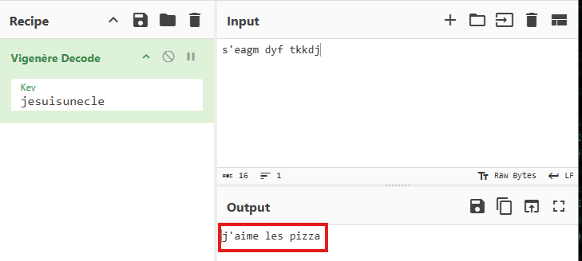
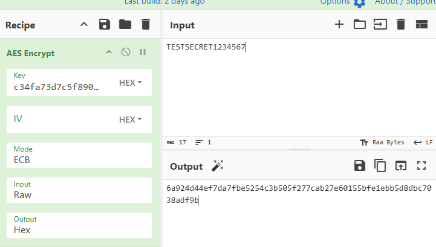
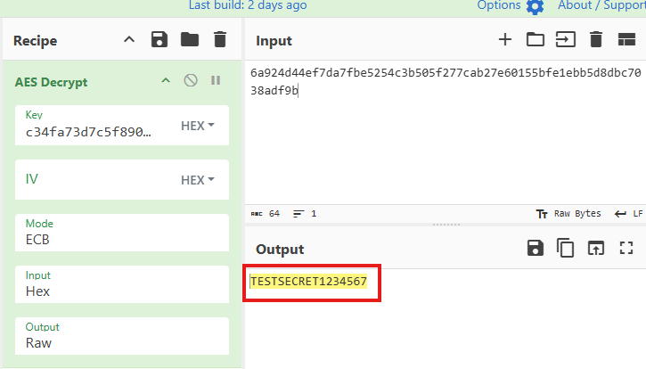

# CyberChef – Cryptographie appliquée

## 4) Tâches à réaliser
### Partie 1 : Chiffrement de César
#### 1. Avec une « Box Height » de 13, chiffrer la phrase suivante : RENDEZ-VOUS À MIDI
   
##### Quel est le texte chiffré ?
ERAQRM-IBHF À ZVQV 

##### Déchiffrez ce texte pour vérifier le résultat
>RENDEZ-VOUS À MIDI

#### 2. Chiffrer le nom de votre film préféré avec une « Box Height » de votre choix
##### Transmettre le texte chiffré à votre binôme sans lui communiquer la clé
>Mf tfjhofvs eft boofbvy

##### Au sein de votre binôme, essayer de retrouver le message en sens inverse
>V pour Vendetta

## Partie 2 : Vigenère
### Encodez le nom de votre plat préféré avec la clé 'KEY'
#### Quel est le texte chiffré ?
>mnthkkdr qzldm

• Transmettre le texte chiffré à votre binôme
• Transmettre la clé à votre binôme par un autre canal
o Au sein de votre binôme, déchiffrez le message pour découvrir vos plats préférés
respectifs
Mon plat :  
>nouilles ramen

Son plat :  

## Partie 3 : Chiffrement symétrique AES
Découverte
• Chiffrez la chaîne 'TESTSECRET1234567' avec les paramètres suivants
o Key : c34fa73d7c5f8901a23e4cd98e7f650d9a17d4e8f902fa0d3286d0beaad219b6
o IV :
o Mode : ECB
o Input : mode Raw
o Output : Hex

• Que constatez-vous si vous modifiez 1 caractère du texte initial ?  
>Le message chiffré change complètement

• Déchiffrez le texte AES chiffré précédemment en adaptant les paramètres
>

o Vous devez retrouver le texte d'origine
### ✅ 🐱 ✅

