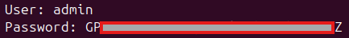

## Installation et configuration de Wazuh  

> #### :bulb: Voici les recommandations matérielles pour faire tourner Wazuh :

### Installation OS 
>✅ J'ai installé **Ubuntu 24.04** avec GUI qui fait partie des OS recommandés avec une carte en bridge.  

>✅ Je mets à jour la liste des paquets et je mets à jour ensuite le système
`sudo apt update && sudo apt upgrade -y`  

### Installation Wazuh
Installation de Wazuh avec curl (après instll de curl)  
`curl -sO https://packages.wazuh.com/4.14/wazuh-install.sh && sudo bash ./wazuh-install.sh -a`  

> :bulb: A la fin de l'installation le username et password sont générés automatiquement.  
>   

## Schéma de l’architecture de supervision
## Documentation d’installation et de configuration de Wazuh
## Captures d’écran du fonctionnement de la plateforme
## Documentation des règles de détection configurées
## Rapport d’analyse des incidents détectés
## Rapport de tests des différents cas d’usage
## Procédure de déploiement et d’exploitation

