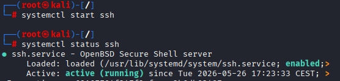

## Installation et configuration de Wazuh  

> #### :bulb: Voici les recommandations matérielles pour faire tourner Wazuh :


### 🔵 Installation OS 
>✅ J'ai installé **Ubuntu 24.04** avec GUI qui fait partie des OS recommandés avec une carte en bridge.  

>✅ Je mets à jour la liste des paquets et je mets à jour ensuite le système
`sudo apt update && sudo apt upgrade -y`  

### Installation Wazuh serveur
>:gear: Installation de Wazuh avec curl (après instll de curl)  
`curl -sO https://packages.wazuh.com/4.14/wazuh-install.sh && sudo bash ./wazuh-install.sh -a`  

> :bulb: A la fin de l'installation le username et un password fort sont générés automatiquement.  
> 


> :bulb: Je peux ensuite me connecter avec l'interface Web : **`127.0.0.1`** et me connecter 


>:bulb: Les user/password sont stockés dans un ficher compressé accessible avec : `sudo tar -O -xvf wazuh-install-files.tar wazuh-install-files/wazuh-passwords.txt`  

> :bulb: Désactivation des mises à jour de Wazuh pour éviter les mises à jour accidentelles susceptibles de perturber l'environnement :  
`sudo sed -i "s/^deb /#deb /" /etc/apt/sources.list.d/wazuh.list`  
`sudo apt update`  


#### ✅ L'installation du SIEM Wazuh est terminée, nous pouvons passer à l'installation de l'agent sur les endpoints pour surveiller leur activité 😹.  

---

## 🔵 Installation Wazuh agent
> :gear: L'agent Wazuh est important sur les machines clientes, c'est lui qui va permettre de faire remonter les logs vers le serveur Wazuh.  

### Agent machine Linux
```bash
# Prérequis
sudo apt install -y gnupg apt-transport-https

# Clé GPG
curl -s https://packages.wazuh.com/key/GPG-KEY-WAZUH | gpg --no-default-keyring --keyring gnupg-ring:/usr/share/keyrings/wazuh.gpg --import && chmod 644 /usr/share/keyrings/wazuh.gpg

# Dépôt (écraser avec > pour éviter les doublons)
sudo bash -c 'echo "deb [signed-by=/usr/share/keyrings/wazuh.gpg] https://packages.wazuh.com/4.x/apt/ stable main" > /etc/apt/sources.list.d/wazuh.list'

# Installer avec l'IP du serveur Wazuh
sudo apt update
sudo WAZUH_MANAGER="192.168.1.19" apt install -y wazuh-agent

# Corriger l'IP dans la config (si MANAGER_IP n'a pas été remplacé)
sudo sed -i 's/MANAGER_IP/192.168.1.19/' /var/ossec/etc/ossec.conf

# ============================================
# 3. CONFIGURER SURICATA DANS WAZUH
# ============================================

# Ajouter les logs Suricata dans la config Wazuh
sudo nano /var/ossec/etc/ossec.conf
# → Ajouter avant </ossec_config> :
# <localfile>
#   <log_format>json</log_format>
#   <location>/var/log/suricata/eve.json</location>
# </localfile>

# ============================================
# 4. DÉMARRER LES SERVICES
# ============================================
sudo systemctl daemon-reload
sudo systemctl enable wazuh-agent
sudo systemctl start wazuh-agent
sudo systemctl status wazuh-agent
```


> **✅ L'agent Wazuh est maintenant installé sur la machine cliente**


> **✅ La machine cliente est maintenant visible sur le dashboard du serveur**

> :bulb: Désactiver les mises à jour de Wazuh sur l'agent pour garder les compatibilités

```bash
sed -i "s/^deb/#deb/" /etc/apt/sources.list.d/wazuh.list
apt-get update
echo "wazuh-agent hold" | dpkg --set-selections
```

### Agent machine Windows

> :bulb: Je passe par l'installation en mode graphique, avec droits admin, je télécharge l'exécutable et je l'installe


> :gear: Je rentre l'IP du serveur dans "Manager IP"


> ✅ Sur le serveur Wazuh dans les endpoints connectés je vois ma machine Windows :  
> 


---

## 🔵 Installation NIDS Suricata  
> :gear: J'installe l'agent Suricata sur la VM cliente Kali qui contient l'agent Wazuh.  

```bash
# 1. Installer le paquet nécessaire pour add-apt-repository (inutile au final, mais nécessaire pour diagnostiquer)
sudo apt update && sudo apt install -y software-properties-common

# 2. Installer Suricata directement via les dépôts Kali (les PPA Ubuntu ne sont pas compatibles)
sudo apt update && sudo apt install -y suricata --fix-missing

# 3. Vérifier l'installation
suricata --version
```

> **✅ L'agent est installé et fonctionnel.**

> :bulb: Télécharger et extraire le jeu de règles Emerging Threats Suricata :
>```bash
>cd /tmp/ && curl -LO https://rules.emergingthreats.net/open/suricata-6.0.8/emerging.rules.tar.gz
>sudo tar -xvzf emerging.rules.tar.gz && sudo mkdir /etc/suricata/rules && sudo mv rules/*.rules /etc/>suricata/rules/
>sudo find /etc/suricata/rules -name "*.rules" -exec chmod 777 {} \;
>```


>:gear: Modifier les paramètres de Suricata dans le `/etc/suricata/suricata.yaml` :  
```yaml
HOME_NET: "<UBUNTU_IP>"
EXTERNAL_NET: "any"

default-rule-path: /etc/suricata/rules
rule-files:
- "*.rules"

# Global stats configuration
stats:
enabled: yes

# Linux high speed capture support
af-packet:
  - interface: eth0 # Bien mettre le nom de sa carte réseau
```
> :gear: Redémarrer le service Suricata pour prendre en compte ls modif :  
`sudo systemctl restart suricata`  

#### Ajout de la config à `/var/ossec/etc/ossec.conf`, qui permettra à Wazuh agent de lire le fichier de journaux Suricata :

```ini
<ossec_config>
  <localfile>
    <log_format>json</log_format>
    <location>/var/log/suricata/eve.json</location>
  </localfile>
</ossec_config>
```

> :bulb: On redémarre l'agent pour la prise en compte des modif :  
`sudo systemctl restart wazuh-agent` : le service doit être running  


### Émulation d'attaque
On lance des pings depuis le serveur vers le client : `ping 192.168.1.145` :  
Sur le Dashboard on voit les paquets ICMP dans les journaux d'évènements  
  

---

## 🔵 Surveillance de l'intégrité de répertoires/fichiers sensibles :  
> :gear: Pour configurer l'agent Wazuh afin qu'il surveille les modifications du système de fichiers dans le répertoire :  

### Sur Client Linux

>**:bulb: Adaptation pour Kali qui ne fonctionne pas comme Ubuntu pour les agents...**  
```bash
# 1. Installer auditd (requis pour whodata)
sudo apt install -y auditd
sudo systemctl start auditd
sudo systemctl enable auditd
```

Modifier : `/var/ossec/etc/ossec.conf` pour ajouter :  
Dans le bloc \<syscheck> :  
`<directories check_all="yes" report_changes="yes" whodata="yes">/root</directories>`  

Dans le bloc \<syscheck> :  
`<frequency>5</frequency>` pour update toutes les 5 secondes  

`sudo systemctl restart wazuh-agent`  


> :gear: Création dans la racine d'un fichier, modif et suppression :  
>```bash
>touch /root/test.txt
>nano /root/test.txt
>rm /root/test.txt
>```


> ✅ Sur le dashboard, les logs de création, modif et suppression apparaissent bien  


### Sur client Windows

> :gear: Dans `C:\Program Files (x86)\ossec-agent\ossec.conf`, je rajoute une ligne spécifique dans le bloc `<syscheck>` pour monitorer le "Bureau" de l'administrateur :  

Je redémarre l'agent Wazuh en PowerShell avec la commande `Restart-Service -Name wazuh`  

> :gear: Je crée un fichier texte dans le chemin spécifié dans le fichier de conf (bureau de l'admin Win), je le modifie, puis je le supprime

> ✅ Je vois sur le Dashboard, les actions réailsées sur le fichier  


---

## 🔵 Détection d'attaques bruteforce

### Sur client Linux 

### Configuration

> :bulb: Sur la machine cliente ciblée il faut un serveur SSH activé 
> 

> :bulb: Côté attaquant, Hydra est déjà installé.   


### Émulation d'attaque
> :gear: Créez un fichier texte contenant 10 mots de passe aléatoires  


> :gear: Côté attaquant je lance le bruteforce avec  passwords aléatoires  


> ✅ Côté serveur, je vois les logs :  


### Sur client Windows

> :gear: Je vérife que le service bureau à distance est bien activé :


> :gear: Je lance l'attaque depuis la machine attaquante avec hydra. J'ai intégré le bon mot de passe dans la liste et réduit la vitesse pour ne pas être refusé par le RDP, grâce à "t -4"


> ✅ Je vois bien sur le Dashboard les logs de connexion et la connexion avec succès  


---

## 🔵 Détection de processus non autorisés

> :gear: Ajout du bloc qui permet d'obtenir périodiquement la liste des processus en cours d'exécution dans `/var/ossec/etc/ossec.conf` :  
```ini
<ossec_config>
  <localfile>
    <log_format>full_command</log_format>
    <alias>process list</alias>
    <command>ps -e -o pid,uname,command</command>
    <frequency>30</frequency>
  </localfile>
</ossec_config>
```
Puis redémarrer l'agent Wazuh...


> :bulb: Sur la machine cliente j'installe (ou je vérifie qu'ils le sont...) "netcat" et "nmap" qui servent respectivement à des ports en TCP/UDP et à écouter les ports ouverts sur un réseau.  


> :gear: Côté serveur Wazuh, dans `/var/ossec/etc/rules/local_rules.xml`, pour créer une règle qui se déclenche à chaque lancement du programme Netcat :  
  

> :gear: Sur le client je lance le port 8000 en écoute : `nc -l 8000`  

> ✅ Sur le serveur je peux voir l'évènement du port en écoute :  


---

## 🔵 Détection de tentatives d'injection SQL
> :bulb: Côté client, vérifier que Apache2 ets bien installé ✅:  


> ✅ Apache2 tourne :  
> 


> :gear: Dans `/var/ossec/etc/ossec.conf`, ajouter les lignes ci dessous pour surveiller les journaux d'accès du serveur Apache  
```ini
<ossec_config>
  <localfile>
    <log_format>apache</log_format>
    <location>/var/log/apache2/access.log</location>
  </localfile>
</ossec_config>
```
> :gear: Redémarrer l'agent Wazuh...

> :gear: sur l'attaquant : `curl -XGET "http://<UBUNTU_IP>/users/?id=SELECT+*+FROM+users";`  


> ✅ Je vois la requête de l'attaquant sur le dashboard :  
  


---

## 🔵 Détection de cheval de troie

> :gear: Paramétrage du fichier `/var/ossec/etc/ossec.conf` sur le client :


> :gear: Puis `sudo cp -p /usr/bin/w /usr/bin/w.copy` pour copier le fichier binaire du système puis remplacer système d'origine /usr/bin/w par le script shell suivant :  
```bash
sudo tee /usr/bin/w << EOF
!/bin/bash
echo "`date` this is evil" > /tmp/trojan_created_file
echo 'test for /usr/bin/w trojaned file' >> /tmp/trojan_created_file
Now running original binary
/usr/bin/w.copy
EOF
```
Redémarrer le service Wazuh-agent... 


> ✅ Je vois la détection d'anomalies et de logiciels malveillants sur le dashboard :  


---

## 🔵 Traitement de malware à travers l'intégration de VirusTotal

### Sur client Linux
#### Côté client

> :gear: Dans `/var/ossec/etc/ossec.conf`, dans bloc `<syscheck>` ajouter la ligne :  


> :gear: Créer `/var/ossec/active-response/bin/remove-threat.sh` et ajouter :  
```bash
#!/bin/bash

LOCAL=`dirname $0`;
cd $LOCAL
cd ../

PWD=`pwd`

read INPUT_JSON
FILENAME=$(echo $INPUT_JSON | jq -r .parameters.alert.data.virustotal.source.file)
COMMAND=$(echo $INPUT_JSON | jq -r .command)
LOG_FILE="${PWD}/../logs/active-responses.log"

#------------------------ Analyze command -------------------------#
if [ ${COMMAND} = "add" ]
then
 # Send control message to execd
 printf '{"version":1,"origin":{"name":"remove-threat","module":"active-response"},"command":"check_keys", "parameters":{"keys":[]}}\n'

 read RESPONSE
 COMMAND2=$(echo $RESPONSE | jq -r .command)
 if [ ${COMMAND2} != "continue" ]
 then
  echo "`date '+%Y/%m/%d %H:%M:%S'` $0: $INPUT_JSON Remove threat active response aborted" >> ${LOG_FILE}
  exit 0;
 fi
fi

# Removing file
rm -f $FILENAME
if [ $? -eq 0 ]; then
 echo "`date '+%Y/%m/%d %H:%M:%S'` $0: $INPUT_JSON Successfully removed threat" >> ${LOG_FILE}
else
 echo "`date '+%Y/%m/%d %H:%M:%S'` $0: $INPUT_JSON Error removing threat" >> ${LOG_FILE}
fi

exit 0;
```

> :gear: Installation de "jq"  


> :gear: Je modifie les droits et la propriété pour obtenir :  


#### Côté serveur  

> :gear: `/var/ossec/etc/rules/local_rules.xml`, ces règles permettent de signaler les modifications apportées au /rootrépertoire et détectées par les analyses FIM :  
```ini
<group name="syscheck,pci_dss_11.5,nist_800_53_SI.7,">
    <!-- Rules for Linux systems -->
    <rule id="100200" level="7">
        <if_sid>550</if_sid>
        <field name="file">/root</field>
        <description>File modified in /root directory.</description>
    </rule>
    <rule id="100201" level="7">
        <if_sid>554</if_sid>
        <field name="file">/root</field>
        <description>File added to /root directory.</description>
    </rule>
</group>
```


> :gear: Création d'un compte sur VirusTotal et récupération de l'API


> :gear: Dans `/var/ossec/etc/ossec.conf`, pour activer l'intégration VirusTotal


> :gear: Ajouter ce bloc dans <ossec_config> pour activer automatiquement le script "remove-threat" lorsque VirusTotal détecte un fichier malveillant  


> :gear: Recevoir des alertes concernant les résultats de la réponse active, dans `/var/ossec/etc/rules/local_rules.xml`, ajouter :  
>    

> :bulb: Redémarrer service.  

> :gear: Télécharger fichier depuis la cible dans /root  


> ✅ Je vois les alertes dans mon Dashboard avec les bons filtres  


### Sur client Windows

> :gear: Je vérifie dans `<syscheck>` de `C:\Program Files (x86)\ossec-agent\ossec.conf` que le disabled est sésactivé


Dans `<syscheck>` je rajoute `<directories realtime="yes">C:\Users\Administrateur.WIN11\Downloads</directories>` pour indiquer le chemin à surveiller en temps réel avec VirusTotal.  

> :gear: Installation de Ptyhon depuis site officiel
> Version installée :  
> 
>

>

> ✅


> :gear: Création du script **remove-threat.py** dans mes "documents" pour supprimer le fichier dans le dossier en surveillance
```python
# Copyright (C) 2015-2025, Wazuh Inc.
# All rights reserved.

import os
import sys
import json
import datetime
import stat
import tempfile
import pathlib

if os.name == 'nt':
    LOG_FILE = "C:\\Program Files (x86)\\ossec-agent\\active-response\\active-responses.log"
else:
    LOG_FILE = "/var/ossec/logs/active-responses.log"

ADD_COMMAND = 0
DELETE_COMMAND = 1
CONTINUE_COMMAND = 2
ABORT_COMMAND = 3

OS_SUCCESS = 0
OS_INVALID = -1

class message:
    def __init__(self):
        self.alert = ""
        self.command = 0

def write_debug_file(ar_name, msg):
    with open(LOG_FILE, mode="a") as log_file:
        log_file.write(str(datetime.datetime.now().strftime('%Y/%m/%d %H:%M:%S')) + " " + ar_name + ": " + msg +"\n")

def setup_and_check_message(argv):
    input_str = ""
    for line in sys.stdin:
        input_str = line
        break

    msg_obj = message()
    try:
        data = json.loads(input_str)
    except ValueError:
        write_debug_file(argv[0], 'Decoding JSON has failed, invalid input format')
        msg_obj.command = OS_INVALID
        return msg_obj

    msg_obj.alert = data
    command = data.get("command")

    if command == "add":
        msg_obj.command = ADD_COMMAND
    elif command == "delete":
        msg_obj.command = DELETE_COMMAND
    else:
        msg_obj.command = OS_INVALID
        write_debug_file(argv[0], 'Not valid command: ' + command)

    return msg_obj

def send_keys_and_check_message(argv, keys):
    keys_msg = json.dumps({"version": 1,"origin":{"name": argv[0],"module":"active-response"},"command":"check_keys","parameters":{"keys":keys}})
    write_debug_file(argv[0], keys_msg)

    print(keys_msg)
    sys.stdout.flush()

    input_str = ""
    while True:
        line = sys.stdin.readline()
        if line:
            input_str = line
            break

    try:
        data = json.loads(input_str)
    except ValueError:
        write_debug_file(argv[0], 'Decoding JSON has failed, invalid input format')
        return OS_INVALID

    action = data.get("command")
    if action == "continue":
        return CONTINUE_COMMAND
    elif action == "abort":
        return ABORT_COMMAND
    else:
        write_debug_file(argv[0], "Invalid value of 'command'")
        return OS_INVALID

def secure_delete_file(filepath_str, ar_name):
    filepath = pathlib.Path(filepath_str)

    # Reject NTFS alternate data streams
    if '::' in filepath_str:
        raise Exception(f"Refusing to delete ADS or NTFS stream: {filepath_str}")

    # Reject symbolic links and reparse points
    if os.path.islink(filepath):
        raise Exception(f"Refusing to delete symbolic link: {filepath}")

    attrs = os.lstat(filepath).st_file_attributes
    if attrs & stat.FILE_ATTRIBUTE_REPARSE_POINT:
        raise Exception(f"Refusing to delete reparse point: {filepath}")

    resolved_filepath = filepath.resolve()

    # Ensure it's a regular file
    if not resolved_filepath.is_file():
        raise Exception(f"Target is not a regular file: {resolved_filepath}")

  # Perform deletion
    os.remove(resolved_filepath)

def main(argv):
    write_debug_file(argv[0], "Started")
    msg = setup_and_check_message(argv)

    if msg.command < 0:
        sys.exit(OS_INVALID)

    if msg.command == ADD_COMMAND:
        alert = msg.alert["parameters"]["alert"]
        keys = [alert["rule"]["id"]]
        action = send_keys_and_check_message(argv, keys)

        if action != CONTINUE_COMMAND:
            if action == ABORT_COMMAND:
                write_debug_file(argv[0], "Aborted")
                sys.exit(OS_SUCCESS)
            else:
                write_debug_file(argv[0], "Invalid command")
                sys.exit(OS_INVALID)

        try:
            file_path = alert["data"]["virustotal"]["source"]["file"]
            if os.path.exists(file_path):
                secure_delete_file(file_path, argv[0])
                write_debug_file(argv[0], json.dumps(msg.alert) + " Successfully removed threat")
            else:
                write_debug_file(argv[0], f"File does not exist: {file_path}")
        except OSError as error:
            write_debug_file(argv[0], json.dumps(msg.alert) + "Error removing threat")
        except Exception as e:
            write_debug_file(argv[0], f"{json.dumps(msg.alert)}: Error removing threat: {str(e)}")
    else:
        write_debug_file(argv[0], "Invalid command")

    write_debug_file(argv[0], "Ended")
    sys.exit(OS_SUCCESS)

if __name__ == "__main__":
    main(sys.argv)
```

> :gear: Copier variable d'environnement, dans l'icone windows, taper "variable d'environnement", on clique sur "Modifier les variables d'environnement système". Cliquer sur "Variables d'environnement...", Dans "Variables utilisateur" (partie haute) → double-clique sur Path. Cliquer sur "Nouveau" et coller : `C:\Users\Administrateur.WIN11\AppData\Local\Python\pythoncore-3.14-64\Scripts`  


> :gear: Convertir le script python "remove-threat.py" en une appli exécutable Windows :  


> ✅ Voici le chemin où se trouve l'exécutable  
  

> :gear: Déplacer fichier exécutable dans... :  
> 


> :bulb: Redémarrer Wazuh `Restart-Service -Name wazuh`  


#### Côté Serveur Wazuh (pour Windows")  

> :bulb: Dans `/var/ossec/etc/ossec.conf`, ajoutez la clé de l'API VirusTotal comme pour la parite Linux (voir au dessus)...

> : Dans `/var/ossec/etc/ossec.conf`, dans bloc `<ossec_config>`activer la réponse active et déclenche `remove-threat.exe` lorsque la requête VirusTotal renvoie des correspondances positives pour des menaces :


> :gear: Afin de recevoir des alertes dans le dashboard Wazuh Server après exécution de la réponse active, il faut rajouter dans `/var/ossec/etc/rules/local_rules.xml` ce nouveau groupe name :  


> :bulb: `sudo systemctl restart wazuh-manager`

#### de nouveau sur le client...

> :gear: Désactiver la protection des menaces en temps réel :  


> :gear: Téléchargement du fichier malveillant "eicar.txt" et copie dans le dossier en surveillance de VirusTotal, càd "Downloads". Il sera détecté, loggé et supprimé par le script Python.  


> ✅ Les logs de création et suppression auto du fichier sont bien présents  
  


---

## 🔵 Détection de vulnérabilités

#### Côté serveur  
> :gear: La détection des vulnérabilités est bien activée dans `/var/ossec/etc/ossec.conf`  


> :bulb: Redémarrer service...

> :gear: Réduction du temps nécessaire de détection de vuln dans `/var/ossec/etc/ossec.conf` de 1H à 10mn  


> ✅ Visualisation dans la détection des vulnérabilités, des CVE de la machine cliente
> 


---

## 🔵 Détection de processus cachés par rootkit

#### Côté client 
> :gear: Le noyau est à jour en root  


> :gear: Installation de `gcc` et `git`  


> :gear: Config dans `/var/ossec/etc/ossec.conf` pour que l'agent Wazuh exécute des analyses rootcheck toutes les 2mn (au lieu de 12H)  
>   

> :bulb: Redémarrer service...  

> :gear: Installation de Diamorphine depuis le dépôt officiel `git clone https://github.com/m0nad/Diamorphine`  
> Puis je vérifie que le rootkit est bien activé. Il tourne en tâche de fond et est peu visible (il faut faire un kill sur PID 63 pour le rendre visible) :
>   
> ✅ Le rootkit est actif ✅  

> :gear: Je vois le processus "journald" actif (journald pour Kali). Puis je "kill -31 +PID de journald", ce qui le rend invisible.


> **✅ Les alertes concernant le Rootkit remontent ✅**  


> :bulb: Pour décharger le rootkit il faut le rendre visible  
`kill -63 0`  
Puis décharger  
`sudo rmmod diamorphine`  

---

## 🔵 Détection de commandes malveillantes

#### Côté client

> :gear: auditd est installé


> :gear: Ajouter les règles d'audit au `/etc/audit/audit.rules`, puis rechargement des règles et vérif qu'elles sont en place :    

> ✅ Elles sont bien là

> :gear: Ajout de la conf dans `/var/ossec/etc/ossec.conf` qui permet à Wazuh agent de lire le fichier de journaux auditd : 

Redémarrer service ....  


#### Côté serveur
> :bulb: Les paires clé-valeur sont bien présentes dans le fichier de recherche


> :gear: Création de la liste CDB `/var/ossec/etc/lists/suspicious-programs` avec :  
```bash
ncat:yellow
nc:red
tcpdump:orange
```

> :gear: J'ajoute la liste "suspicious-programs" à la <ruleset> dans `/var/ossec/etc/ossec.conf` :
> `<list>etc/lists/suspicious-programs</list>` :  

> :gear: Création d'une règle de haute gravité qui se déclenchera lorsqu'un programme « rouge » est exécuté :  

Redémarrer service Wazuh ensuite...  

#### Emulation d'attaque
> :gear: J'installe Netcat sur la machine cliente, ici version openBSD 


> ✅ On voit bien les alertes sur le Dashboard du serveur Wazuh lorsque j'installe et lance "Netcat" sur la machine cliente  


---

## 🔵 Détection d'attaques Shellshock

#### Côté client

> :bulb: le serveur apache est déjà installé
>   

> :gear: Dans le fichier de conf de l'agent Wazuh `/var/ossec/etc/ossec.conf`, j'ajoute un bloc de code pour qu'il surveilles les Logs d'accès à Apache   
```ini
<localfile>
    <log_format>syslog</log_format>
    <location>/var/log/apache2/access.log</location>
</localfile>
```
Redémarrer agent Wazuh...  

#### Emulation de l'attaque

> :gear: Sur la machine attaquante je lance ma requête Web avec curl pour l'attaque Shellshock en indiquant l'IP du serveur Web (machine cliente)  
> `sudo curl -H "User-Agent: () { :; }; /bin/cat /etc/passwd" 192.168.1.145`  
> ✅ Les logs de l'attaque remontent bien dans le Dashboard du serveur Wazuh
> 


---

## Schéma de l’architecture de supervision
## Documentation d’installation et de configuration de Wazuh
## Captures d’écran du fonctionnement de la plateforme
## Documentation des règles de détection configurées
## Rapport d’analyse des incidents détectés
## Rapport de tests des différents cas d’usage
## Procédure de déploiement et d’exploitation
