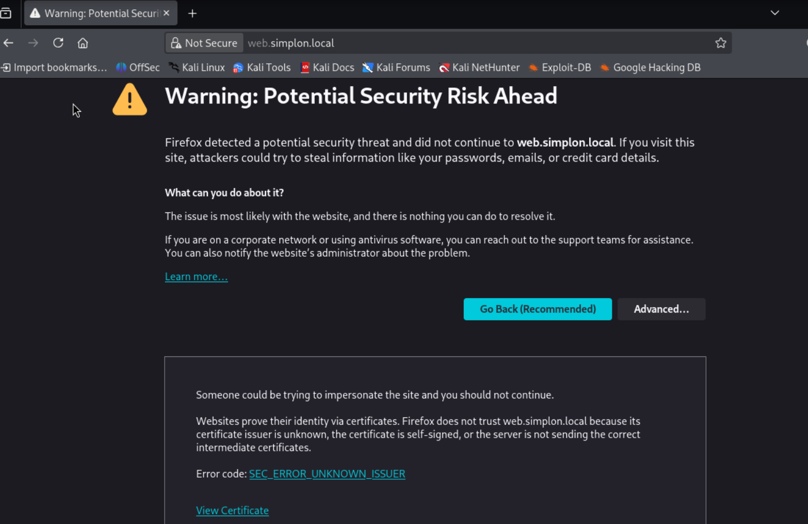
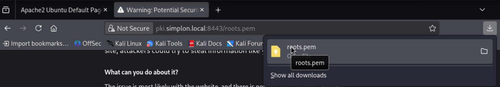

Script sur VM PKI :  
  

Depuis VM cliente, le serveur répond bien avec le nom DNS `web.simplon.local`  
  

### B. Configuration de la VM Client (hôte)  
Une fois les conteneurs déployés, vous devez pouvoir accéder au site web depuis une VM Debian ou Windows dans le même segment réseau que l'infra PKI. ⚠️ Action requise : Changez la configuration de votre carte réseau pour utiliser l'IP de votre conteneur DNS comme DNS primaire (ex: 192.168.100.20).  
  

### C. Test HTTP et Capture  
  

### D. Mise en place du SSL  

Votre objectif : Mettre en place SSL sur le serveur web à l'aide de Certbot et de votre autorité PKI interne.  

* **Que constatez-vous lors du premier test en HTTPS ?**  
>✅ La page s'affiche en HTTPS car il y a un certificat côté serveur, mais le navigateur côté client ne reconnait pas le certificat, nous n'avons pas le cadenas sécusiré, il faut donc importer le certificat.  

* **Comment résoudre le problème lié au certificat auto-signé / autorité inconnue ?**  
>✅ Il faut importer le certificat auto-signé dans le magasin de confiance du client ou le faire signer par une CA reconnue.  

#### 1. Importer l'autorité de certification (CA) sur le serveur WEB
Pour que le serveur Web (et Certbot) fasse confiance à notre PKI interne, il faut lui transmettre le certificat racine.  

Sur le serveur PKI : Vérifiez la présence des certificats, puis copiez le certificat racine vers le serveur Web :  

  
  

Sur le serveur WEB : Déplacez le certificat reçu et mettez à jour le magasin de confiance de Debian :  
  

#### 2. Obtenir et déployer le certificat SSL avec Certbot  
Toujours sur le serveur WEB : Lancez Certbot en lui indiquant l'URL ACME de votre PKI interne :  
  

#### 3. Test HTTPS et Validation Client  
1. Lancez une nouvelle capture Wireshark.  
2. Allez sur [https://web.simplon.local/](https://web.simplon.local/).  
 

3. Analyse : Le trafic est désormais chiffré. Quel protocole est utilisé ? (Regardez dans Wireshark, vous devriez voir du TLS 1.3). Normalement vous devez voire du TLS 1.3. Si ce n’est pas le cas, votre navigateur n’est pas a jour ou est mal configuré Dans Chrome, taper > chrome://flags/#tls13-variant  
>✅ HTTPS = HTTP over TLS 1.3 (avec TCP en couche transport)  

4. Alerte de sécurité du navigateur : Votre navigateur affichera un avertissement de sécurité. C'est normal, votre VM Client ne connaît pas encore la PKI interne !  
  

5. Résolution côté client :  
Depuis votre VM Client, rendez-vous sur l'URL : [https://pki.simplon.local:8443/roots.pem](https://pki.simplon.local:8443/roots.pem)  
Le certificat racine se télécharge.  
  
Importez-le dans le magasin de certificats de votre système d'exploitation ou directement dans les paramètres de votre navigateur (Autorités de certification de confiance).  
Rechargez la page web : le cadenas vert doit s'afficher.  

  
  

  

